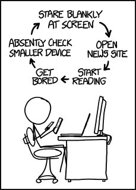

# Intro to Iteration

## Learning Goals

- Define iteration

## Introduction

Korey has a summer reading list of books she wants to read. She's an ambitious reader, so as she finishes each book, she finds herself needing to look through her list over and over to find the next book to start. When she reaches the end of her list, she'd like to find out how many pages she read in total, and proudly share her accomplishment!

Korey is not the only reader. What if we needed to do these operations for every reader out there with a reading list? What if someone had a reading list of a thousand books?

In programming, we can approach these problems with iteration.

## Vocabulary and Synonyms

| Vocab     | Definition                              | Synonyms | How to Use in a Sentence                                                                                                                   |
| --------- | --------------------------------------- | -------- | ------------------------------------------------------------------------------------------------------------------------------------------ |
| Iteration | A sequence of instructions that repeats | Loop     | "We should iterate over that list," "My code never gets to the iteration part," "My code iterates over that dictionary to find the scores" |

## Iteration Is Repeating

Iteration in programming is a sequence of instructions that repeats.

  
[(source)](https://xkcd.com/1411/)

## Iteration Solves Problems

As programmers, as we see and solve more problems, we'll see a pattern about when to consider using iteration.

### Finding One Element

We can use iteration to _find_ a specific element from a list!

We can also use iteration to find a specific kind of element, or an element with a specific property.

Iteration is often used to find the _first_ element that matches the criteria.

#### Examples: Finding One Element

1. Looking through a reading list, and finding the tenth book.
1. Looking through a reading list, and finding the first book with the title `"all about love"`.
1. Looking through a reading list, and finding the first book that is a biography.

### Operating on Each Element

We can use iteration to perform an operation on each element in the list.

We can use iteration to do operations like...

- calculate something based off each element in a list
- collect each item in a list, modifying it, and put it in another list
- comparing each element to something else

#### Examples: Operating on Each Element

1. Looking through a reading list, and collecting the total number of pages of every book in the list
1. Looking through a reading list, and putting each book into my shopping cart.
1. Looking through a reading list, and seeing if each book is bigger than the English dictionary.

## Summary

There are so many other things that iteration is great for! Let's be sure to keep an eye out for new and exciting iteration techniques as we continue our programming journey!

## Check for Understanding

<!-- Question 1 -->

<!-- prettier-ignore-start -->
### !challenge
* type: checkbox
* id: dfc8fa62-40c7-4489-8ab3-f91eb5c67579
* title: Iteration Examples
##### !question
Iteration is useful in many scenarios. Mark each scenario that utilizes iteration.
##### !end-question

##### !options
* Looking through items in an online shopping cart, and adding the cost of each item to the total. 
* Looking through a list of sales transactions, and finding the highest grossing sales transaction of the day.
* Looking through a clean laundry basket, and finding matching pairs!
##### !end-options

##### !answer
* Looking through items in an online shopping cart, and adding the cost of each item to the total. 
* Looking through a list of sales transactions, and finding the highest grossing sales transaction of the day.
* Looking through a clean laundry basket, and finding matching pairs!
##### !end-answer

##### !explanation
All of these options are correct! These scenarios all involve iterating through sets of data and executing logic to produce a specific outcome.
##### !end-explanation

### !end-challenge
<!-- prettier-ignore-end -->

<!-- Question Takeaway -->
<!-- prettier-ignore-start -->
### !challenge
* type: paragraph
* id: 2dfkql
* title: Intro to Iteration
##### !question

What was your biggest takeaway from this lesson? Feel free to answer in 1-2 sentences, draw a picture and describe it, or write a poem, an analogy, or a story.

##### !end-question
##### !placeholder

My biggest takeaway from this lesson is...

##### !end-placeholder
### !end-challenge
<!-- prettier-ignore-end -->
