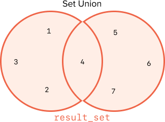
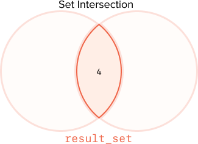

# Sets 

## Introduction 

Sets are a unique data structure in Python.  Sets can be used to store data like lists and dictionaries, but sets also have a wide array of built in functionality based on the concept of sets in mathematics, and this is where sets really shine!  In this lesson we will explore the basics of sets and look at the ways we can take advantage of the features of sets in algorithms and problem solving.

## Vocabulary and Synonyms 

| Vocab | Definition | Synonyms | How to Use in a Sentence |
| ----------------- | ----------------------------------------------------------------------------------------------------- | -------- | --------------------------------------------------------------------------------------------------------------------------------------------------- |
| Set |  |  |
| Union |  |  |
| Intersection |  |  |
| Difference |  |  |
| Disjoint |  |  |

## Set Basics

Sets are like buckets that can hold things!  Just like a bucket, we can add things to a set, remove things from a set, and dump everything out.  In addition, we can do many interesting things around comparing the contents of one set to another and combining the contents in specific ways.

 There are a few rules that govern sets:

1. Each element of a set is unique.
1. Each element of a set must be immutable.
1. Elements in a set are unordered.

### Set Operations and Syntax

1. Create a new set:
```python

new_set = set() # To create an empty set, use the keyword set()
set_with_contents = {1, 2, 3, 'a', 'b'} # To create a set with contents, use {}
# like dictionaries.  Notice the difference from dictionaries, each element is
# on it's own, there are no key-value pairs.

```
1. Add an element to a set:
```python

set_a = {1, 2, 3}
set_a.add(4) # set_a now equals {1, 2, 3, 4}

```
1.  Remove an element from a set:
* There are two ways to remove an element, remove() which raises an error if the element is not present, and discard() which does not.
```python

set_a = {1, 2, 3}
set_a.remove(1) # set_a now equals {2, 3}
set_a.remove(4) # Raises a KeyError

set_a.discard(2) # set_a now equals {3}
set_a.discard(4) # does nothing

```
1. Remove and return a random element from a set
```python

set_a = {1, 2, 3}
random_element = set_a.pop() # random_element equals a random element from set_a, and that element has been removed from set_a

set_b = set()
random_element = set_b.pop() # Throws a KeyError, can't pop from an empty set

```
1. Remove all elements from a set 
```python
set_a = {1, 2, 3}
set_a.clear() # set_a is now an empty set

```

### Set Interactions

Now that we are familiar with the basic set operations, we can get into the exiting world of set to set interactions!  Lets start with two basic sets:

  
*Fig. Set A {1, 2, 3, 4} and Set B {4, 5, 6, 7}.*

#### Union

The union of two sets combines the sets into a new set that includes all of the elements of the original sets.  Any overlapping elements are included only once in the result set.

  
*Fig. Result Set {1, 2, 3, 4, 5, 6, 7}.*

```python

set_a = {1, 2, 3, 4}
set_b = {4, 5, 6, 7}

# Two syntax methods to create a set union:
# union() function:
result_set1 = set_a.union(set_b) # {1, 2, 3, 4, 5, 6, 7}

# | operator:
result_set2 = set_a | set_b # {1, 2, 3, 4, 5, 6, 7}
```

#### Intersection

The intersection of two sets is a new set composed of all of the elements that were present in both sets.  The overlapping elements are included only once in the result set.

  
*Fig. Result Set {4}.*

```python

set_a = {1, 2, 3, 4}
set_b = {4, 5, 6, 7}

# Two syntax methods to create a set intersection:
# intersection() function:
result_set1 = set_a.intersection(set_b) # {4}

# & operator:
result_set2 = set_a & set_b # {4}
```

#### Difference

The difference of two sets is a new set composed of all of the elements of the first set except for the elements that were in the second set.  

  
*Fig. Result Set {1, 2, 3}.*

```python

set_a = {1, 2, 3, 4}
set_b = {4, 5, 6, 7}

# Two syntax methods to create a set difference:
# difference() function:
result_set1 = set_a.difference(set_b) # {1, 2, 3}

# - operator:
result_set2 = set_a - set_b # {1, 2, 3}
```

#### And More!

There are more set interactions in Python that we will not cover in this curriculum.  Follow your curiosity!

### Set Comparisons


## Sets and Problem Solving

Now that we know set basics, let's take a look at how we can use sets to solve problems!  Lets say we are building a tool to compare 

### Creating Sets From Other Data Structures

We can easily convert other data types

### Iterating Through Sets